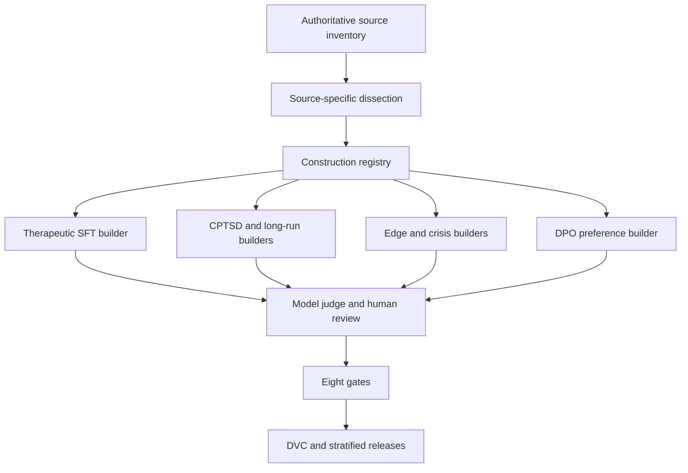

# Requirements

### Overview & Goals

Replace the previous agent's verb/card workflow with the original intended program: **every real corpus in the dataset inventory is deliberately dissected by users/agents, its useful information is preserved with provenance, and NVIDIA NeMo Data Designer constructs new training-ready datasets from that source understanding.** The unified P-list and Linear project `AI Training Pipeline` remain the planning backbone.

This is not a merge, format conversion, excerpt-card pass, or “fill gaps after 77K rows” exercise. Existing ChatML is one source family among many; unstructured books, transcripts, clinical corpora, scenarios, annotations, evals, remote backups, and generated collections must each receive a source-specific analysis and an explicit role in one or more constructed products.

### Scope

**In scope**
- Full reset of the previous agent's artifacts: remove the existing files `14-dataset-inventory.md` through `22-extract-remote-coverage.md`, restore `13-unified-task-plan.md` without its injected operator header, remove the two untracked `extract_*_inventory_facts.py` scripts and all session-created `ai/data/curated/v8/` scratch outputs.
- Cancel/archive PIX-4435–4472 as invalid planning history and remove them from the active `AI Training Pipeline` project view.
- Rebuild a neutral source inventory from `01`–`12`, especially `07-unified-dataset-catalog.md`, location scans, license notes, and verified local/remote paths.
- Build a two-axis construction matrix: **source-specific dissection dossiers** × **training-product builders** for therapeutic SFT, long-running therapy, CPTSD, edge cases, crisis/safety, DPO, and knowledge-grounded tasks.
- Align the matrix to `13` P0/P2/P11–P15 and integrate the existing PIX-4344/4346/4347 review, DVC, and split implementations instead of creating a competing workflow.
- Replace the unsafe legacy Data Designer script with SDK-native, validated configurations using the installed `data-designer==0.9.1` package.

**Out of scope**
- Blindly concatenating corpora, declaring source rows training-ready, arbitrary sample/card caps, or treating a mechanical filter as clinical curation.
- Running a full `data-designer create` job or a GPU training job; this plan produces validated configurations, reviewed previews, approved generation commands, and versioned construction inputs.
- Silently discarding a source because it is remote, unstructured, evaluation-only, copyrighted, NC, or awkward. Every source is dissected; its usage policy determines whether it contributes direct seed content, abstracted patterns/rubrics, evaluation structure, RAG knowledge, or research-only output.

### Functional Requirements

1. **Authoritative inventory:** one row per real corpus/family, with aliases and backups nested beneath it; record all locations (local, `gdrive:`, `whitebat:`), schema/modality, ownership/license, content scope, provenance, verification state, and related P-list/Linear work.
2. **Complete dissection:** each inventory row has an accountable source issue and a completed dossier describing clinically useful concepts, scenarios, response strategies, dialogue dynamics, safety/contraindication signals, longitudinal structure, cultural context, and target products. No fixed excerpt count substitutes for review.
3. **Structured construction registry:** preserve selected information as source-analysis records with stable source/unit references and use restrictions. These are construction inputs—not “fact cards,” not final ChatML, and not a claim of clinical correctness.
4. **Reusable product builders:** Data Designer configurations construct the target schemas required by P2/P11/P12/P14/P15, with source registry fields available as seed variables and provenance retained through generation.
5. **Human + model review:** use `nvidia-text` for draft generation and `nvidia-reasoning` for structured analysis/judging, followed by PIX-4344 human review and IAA on clinically sensitive outputs.
6. **Linear traceability:** source issues answer “what did we learn from this corpus?”; product issues answer “what training artifact did we construct?”; cross-links show which source analyses feed each product.
7. **No false completion:** issues close only when review artifacts, manifests, Data Designer previews, validation evidence, and downstream links exist—not when a source was merely listed or sampled.

# Technical Design

### Current Implementation

- `.agent/internal/data/07-unified-dataset-catalog.md` is the broad pre-existing corpus catalog; `01`–`12` contain storage, access, planning, and Linear evidence. They are imperfect but precede the rejected workflow.
- `.agent/internal/data/13-unified-task-plan.md` contains the relevant original work: P2 DPO, P11 CPTSD, P12 knowledge integration, P13 eight gates, P14 NeMo Data Designer, and P15 long-running therapy. Its line-4 operator overlay is later pollution and must be removed.
- Files `14`–`22` were created by the prior agent and progressively replaced the P-list with six verbs, arbitrary caps, cards, local-only and then capped remote scans, and a scratch `v8/train.jsonl`; they are reset rather than treated as architecture.
- Linear `AI Training Pipeline` has the correct phase spine. `11-linear-datasets.md` still labels PIX-4344/4346/4347 Todo, but Foresight reports their IAA, DVC, and stratified-split implementations completed on separate `ai` branches with pushes deferred; branch/merge status must be reconciled before they are treated as available. PIX-4345 remains the direct synthetic-generation workstream.
- NVIDIA Data Designer `0.9.1` is installed and configured with `nvidia-text`, `nvidia-reasoning`, `nvidia-vision`, and `nvidia-embedding`. `LocalFileSeedSource` supports JSONL/JSON/CSV/Parquet, and generated columns can use structured outputs, judges, validators, processors, and Jinja references to seed fields.
- `scripts/data/pixelated_edge_cases_designer.py` and its L40S companion are the closest implementation examples, but the former hardcodes credentials, performs ad hoc OpenAI calls inside a custom generator, swallows failures, and inserts fallback dialogue. It must not become the new foundation.

### Key Decisions

- **Full reset:** remove prior-agent docs, scripts, scratch datasets, and PIX-4435–4472; retain verified observations only after independently re-entering them into the new inventory with evidence.
- **Two-axis matrix:** source work and product work are separate but linked. This guarantees every corpus is dissected once, while construction logic is reusable across datasets.
- **All sources participate:** “use all datasets” means every source receives analysis and a declared contribution mode; legal/eval restrictions alter the mode, not whether the source is examined.
- **SDK-native Designer:** configurations use `DataDesignerConfigBuilder`, seed sources, structured columns, judge columns, validators, and schema transforms. No direct provider clients, embedded secrets, silent fallback conversations, or global queues.
- **Generation/review split:** `nvidia-text` drafts; `nvidia-reasoning` extracts structured source understanding and judges/revises outputs; humans adjudicate sensitive clinical and safety samples through PIX-4344.

### Architecture



### Source Axis Contract

Each real corpus/family receives a dossier and one Linear source issue. Aliases, derived copies, and backup replicas remain nested under that source rather than becoming fake new datasets.

```text
source_id, canonical_name, aliases, locations[], access_state,
license_and_use_policy, schema_and_modality, content_scope,
unit_definition, inspection_coverage, useful_information[],
clinical_concepts[], scenario_patterns[], response_strategies[],
safety_signals[], contraindications[], dialogue_dynamics[],
longitudinal_signals[], cultural_context[], target_products[],
source_unit_refs[], reviewer_decisions[], provenance_hashes[]
```

The dossier may reference text, media, labels, rubrics, or structure. It must explain what was inspected and why selected material matters. It cannot be completed by listing filenames, taking the first N rows, regex matching, or counting turns.

### Product Axis Contract

| Unified task | Builder | Constructed output |
|---|---|---|
| P14 core SFT | `therapeutic_sft.py` | Single- and multi-turn therapeutic conversations grounded in approved source analyses |
| P15 long-running therapy | `long_running_therapy.py` | Longitudinal sessions with continuity, memory, rupture/repair, and progression |
| P11 CPTSD | `cptsd_dialogues.py` | CPTSD scenarios, recovery stages, flashbacks, regulation, boundaries, and crisis-aware responses |
| P14 edge cases | `edge_cases.py` | Ten planned complexity/safety families across difficulty levels |
| P14/P21 crisis safety | `crisis_safety.py` | Safe response and escalation examples with explicit contraindications |
| P2 DPO | `dpo_preferences.py` | Chosen/rejected pairs with reason codes and safety/quality dimensions |
| P12 knowledge | `knowledge_tasks.py` | Citation-bearing knowledge/RAG tasks where direct conversationalization is not permitted |

Every builder keeps source IDs, construction-spec version, model alias, prompt version, judge scores/reasons, human review status, and lineage hashes in the output. Final schema transforms can emit ChatML, DPO, or retrieval formats without dropping the richer audit columns from the construction release.

### Linear Design

- Restore `AI Training Pipeline` as the only active project spine; do not create another “operator of record.”
- Add one **Source Inventory & Dissection** parent with one child per real corpus/family from the rebuilt inventory. Each child owns access, full inspection strategy, dossier, use policy, and product links.
- Re-scope PIX-4345 as the **Data Designer Construction** parent with product children mapped to P2/P11/P12/P14/P15.
- Verify the separate-branch implementations associated with PIX-4344/4346/4347, then create linked follow-up issues only for missing integration: dossier/preview review strata, construction-registry DVC artifacts, and source/product/safety split axes.
- Reuse the completed IAA, DVC, and stratified-split modules after verification rather than reopening or duplicating them.
- Update `.agent/internal/data/11-linear-datasets.md` and `13-unified-task-plan.md` with these links; do not inject a superseding header.

### File Structure

```text
.agent/internal/data/
  14-source-construction-inventory.md
  15-source-product-linear-matrix.md
scripts/data/designer/
  schemas.py
  source_registry.py
  validators.py
  configs/
    therapeutic_sft.py
    long_running_therapy.py
    cptsd_dialogues.py
    edge_cases.py
    crisis_safety.py
    dpo_preferences.py
    knowledge_tasks.py
  tests/
ai/data/curated/construction/
  source_registry/
  previews/
  releases/
```

The reset removes the old files named `14-dataset-inventory.md` through `22-extract-remote-coverage.md`, both `ai/scripts/extract_*_inventory_facts.py` files, and only the scratch `ai/data/curated/v8/` outputs attributable to the rejected run. Source corpora under `ai/data/raw/` and `ai/data/curated/sft_chatml/` remain untouched.

### Risks & Mitigations

- **Clinical overclaim:** a model-produced source analysis is not automatically correct; require evidence references and human adjudication for clinical/safety strata.
- **Copyright/license leakage:** retain per-unit usage policy; use restricted sources for abstracted taxonomies, evaluation structure, or RAG rather than reproducing protected text.
- **Eval contamination:** eval sources can inform task/rubric design, but their prompts, answers, and close paraphrases are blocked from train releases.
- **Remote scale:** inspect through manifests, resumable shards, and coverage checkpoints; do not equate “streamed first N lines” with corpus completion.
- **Credential exposure:** remove plaintext provider keys from the legacy script, rotate the exposed credentials, and use environment/provider configuration before any preview.
- **False closure:** Linear completion requires linked dossier/config/preview/review artifacts and coverage evidence.

# Testing

### Validation Approach

Validation is performed at four boundaries: reset integrity, source coverage, Data Designer configuration/preview quality, and release gates. Counts and hashes support the review but never stand in for semantic inspection.

### Key Scenarios

- **Reset:** the prior filenames `14-dataset-inventory.md` through `22-extract-remote-coverage.md`, PIX-4435–4472, untracked card scripts, and attributable scratch outputs are gone/inactive; original source corpora and pre-existing plans `01`–`13` remain.
- **Inventory reconciliation:** every corpus in `07` and every additional source verified by `04`, `06`, `10`, and `12` appears exactly once as a canonical source with aliases/replicas attached.
- **Coverage:** every inventory source has a Linear issue, dossier, inspection coverage statement, usage mode, and at least one product link; no “missing/local-only/skip” shortcut satisfies completion.
- **Designer configs:** run `data-designer validate` for every builder; no schema warnings, missing seed variables, provider secrets, direct API clients, or swallowed generation failures.
- **Preview review:** run `data-designer preview --save-results`; review representative strata across source, product, diagnosis/topic, difficulty, culture, safety severity, and conversation length before approving generation commands.
- **Lineage:** each preview/output record resolves to source analysis units, config/prompt versions, model aliases, judge results, and review decisions.
- **Clinical/safety:** unsafe advice, diagnosis overreach, fabricated citations, crisis mishandling, sycophancy, and protected-text reproduction fail review.
- **Release:** P13's coverage, leakage, distribution, PII, provenance, hash, split, and stats gates pass before DVC publication.

### Test Changes

- Add unit tests for source-registry schema validation, alias collapsing, use-policy enforcement, eval-leakage blocks, lineage propagation, and output schema transforms.
- Add config-loading tests for every `load_config_builder()` implementation.
- Add deterministic fixtures that verify restricted/eval sources cannot emit disallowed direct training text while remaining represented in the construction matrix.
- Scan the final diff for secrets and suppression comments; rotate any credentials exposed by the legacy designer script.

# Execution Steps

### ✓ Step 1: Reset rejected artifacts and invalid Linear history

- Remove prior-agent files `14`–`22`, both card-extraction scripts, and attributable `ai/data/curated/v8/` scratch outputs.
- Restore `13-unified-task-plan.md` without the injected operator overlay.
- Cancel/archive PIX-4435–4472 and remove them from the active `AI Training Pipeline` project view.
- Verify original source corpora and files `01`–`13` remain intact.

### ✓ Step 2: Reconcile the authoritative source inventory

- Rebuild one canonical row per real corpus/family from `01`–`12`, with aliases, replicas, locations, use policy, verification evidence, P-list mapping, and planned contribution modes.
- Write `.agent/internal/data/14-source-construction-inventory.md` and verify every catalogued source is represented exactly once.

### ✓ Step 3: Implement the construction registry and policy tests

- Implement source-analysis schemas, alias collapsing, use-policy enforcement, eval-leakage protection, lineage propagation, and output transforms under `scripts/data/designer/`.
- Add deterministic tests and representative registry fixtures under `ai/data/curated/construction/source_registry/`.

### ✓ Step 4: Implement and test the seven product builders

- Add SDK-native configs for therapeutic SFT, long-running therapy, CPTSD, edge cases, crisis safety, DPO preferences, and knowledge tasks.
- Replace unsafe legacy Designer behavior and add config-loading tests without embedded credentials, direct provider clients, silent fallbacks, or suppression comments.

### ✓ Step 5: Validate configurations and generate reviewed previews

- Run `data-designer validate` for all seven builders and resolve every warning/error.
- Run saved previews, review representative strata and lineage, and record approved generation commands without running a full create job.

### ✓ Step 6: Rebuild Linear traceability and planning documents

- Create the Source Inventory & Dissection parent and one source child per canonical inventory row.
- Re-scope PIX-4345 and add product children; verify PIX-4344/4346/4347 branch state and create only necessary integration follow-ups.
- Write `.agent/internal/data/15-source-product-linear-matrix.md` and update `11`/`13` with source/product/review/DVC/split links.

### ✓ Step 7: Run final integrity gates and capture durable context

- Verify reset integrity, complete source/product coverage, registry lineage, clinical/legal/eval restrictions, tests, and secret/suppression scans.
- Review the final diff, update plan status, and complete Foresight transcript, memory, and pending-item gates.