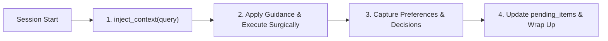

# AGENTS.md

> Universal Agent Operating Protocol for **Pixelated Empathy** and
> **Foresight**.

---

## 1. ⚡ Mandatory Session Lifecycle (Foresight Memory Protocol)

Every agent session touching real work must follow this streamlined continuity
lifecycle:



### A. Session Startup (Mandatory)

Ambient auto-injection hooks automatically populate `[FORESIGHT CONTINUITY CONTEXT]` on Turn 1 across Claude Code, OpenCode, OMP, and Antigravity.

When calling explicitly (or on topic shifts / subagent starts):
- **Claude / OpenCode / OMP**: Direct MCP tool call `inject_context(conversation_text="...")` (or `mcp__foresight__inject_context`).
- **Antigravity / Gemini CLI** (lazy MCP tools): `call_mcp_tool(ServerName="foresight", ToolName="inject_context", Arguments={"conversation_text": "..."})`.
- **Output**: Surfaces relevant memories, active project directives, `user_preferences`, and `pending_items`.
- **Action**: Silently incorporate retrieved context into your reasoning and approach.

### B. In-Session Continuity & Capture

- **When user states a preference or rule** (_"prefer X over Y"_, _"always do Z"_):
  Update `user_preferences` context block immediately (`manage_context_blocks` or `call_mcp_tool`).
- **When key decisions or facts are finalized**:
  Store concise distilled statement (`manage_memories` with `category="decision"|"fact"`).

### C. Session Wrap-Up

Ambient hooks trigger `process_session_transcript` automatically on session completion. When wrapping up explicitly:
- Update `pending_items` block marking finished tasks and listing follow-ups (`manage_context_blocks`).
- For long multi-turn sessions without auto-capture: Call `process_session_transcript(session_id="...", messages=[...])`.

---

## 2. 🚀 Runtime Services & Key Commands

### Stack

- **Frontend / SSR**: Astro 6 + React 19 (TypeScript, Tailwind CSS)
- **Backend / AI Services**: FastAPI / Express / Flask (Python 3.12+ via `uv`,
  Node v24 via `pnpm`)
- **Databases**: PostgreSQL 17 + pgvector (`5432`), MongoDB (`27017`), Redis
  (`6379`)

### Essential Execution Matrix

| Domain         | Action                   | Command                                                |
| -------------- | ------------------------ | ------------------------------------------------------ |
| **Submodules** | Init & sync (first step) | `git submodule update --init --recursive`              |
| **Node / TS**  | Dev Server               | `pnpm dev` _(port 5173)_ or `pnpm dev:all-services`    |
|                | Lint (type-aware)        | `pnpm lint` (oxlint)                                   |
|                | Format                   | `pnpm format`                                          |
|                | Unit & Integration Tests | `pnpm vitest run -c config/vitest.config.ts`           |
|                | Production Build         | `pnpm build`                                           |
| **Python**     | Run script / module      | `uv run python <script.py>` / `uv run python -m <pkg>` |
|                | Pytest Test Suite        | `uv run pytest`                                        |
|                | Lint & Format            | `uv run ruff check .` / `uv run ruff format .`         |
| **Foresight**  | System Health            | `foresight doctor` / `foresight security status`       |
|                | Run Proof Benchmark      | `foresight prove`                                      |

---

## 3. 🛡️ Core Developer Rules & Anti-Suppression Policy

### ✅ Always

- **Zero Project-Level Config Pollution**: Agent-specific configs/dotfiles
  belong strictly in global `~/.<agent_name>`. Never commit agent dotfiles into
  project roots.
- **Surgical Edits**: Keep changes minimal, tightly scoped, and clean. Remove
  only code your changes make obsolete.
- **Clinical Privacy & HIPAA Compliance**: Preserve therapeutic gating and data
  isolation. Never expose clinical PHI or sensitive keys.
- **Verify Explicitly**: Validate every code change with real test/lint
  execution before marking done.

### 🚫 Banned Type-Check Tooling (OOM Risk)

> [!IMPORTANT] **STOP using `astro check`, `pnpm typecheck`, and `tsc`.** They
> are all far too slow and heavy, and repeatedly cause out-of-memory (OOM)
> failures. Do **not** run them, and do **not** add them to CI, scripts, or
> pre-commit hooks.
>
> Use **oxlint with type-aware flags** for lint/type verification instead:
> `pnpm lint` (type-aware oxlint).

### 🚫 Strict Anti-Suppression Policy (Zero Tolerance)

> [!IMPORTANT] **Never suppress errors or warnings to fake a passing build. Fix
> root causes.**

- **TypeScript**: No `@ts-ignore`, `@ts-nocheck`, or `@ts-expect-error` (unless
  pre-existing in mock fixtures).
- **Python**: No `# noqa`, `# type: ignore`, or blanket `# pylint: disable`.
- **JavaScript / ESLint**: No `/* eslint-disable */` or scoped rule bypasses.
- **Config Downgrades**: Never alter `tsconfig.json`, `.eslintrc`, or test
  configs to lower strictness.
- **Secrets**: Never hardcode credentials, API tokens, passwords, or
  patient-identifiable data in code, tests, or mock fixtures.

---

## 4. 🧠 Foresight Tooling & API Reference

| MCP Tool                     | Purpose                                 | Primary Arguments                              |
| ---------------------------- | --------------------------------------- | ---------------------------------------------- |
| `inject_context`             | Single-roundtrip context retrieval      | `conversation_text`, `max_memories=5`          |
| `manage_memories`            | Store, update, delete, archive memories | `action="store"`, `category`, `content`        |
| `search_memories`            | Keyword, semantic, hybrid search        | `query`, `use_hybrid=True`, `limit`            |
| `manage_context_blocks`      | Standing guidance & user preferences    | `action="get"\|"update"`, `label`, `content`   |
| `manage_encryption`          | AES-256-GCM security controls           | `action="status"\|"rotate_key"\|"encrypt_all"` |
| `process_session_transcript` | End-of-session auto-distillation        | `session_id`, `messages`                       |
| `get_system_status`          | Health, cache, and encryption telemetry | `include_trends=True`                          |

---

## 5. 🧭 Skill Discovery with SkillRoute

When facing complex, cross-domain, or unfamiliar tasks, discover the optimal
skill:

```bash
skillroute route "<task description>"  # Determine best matching skill
skillroute search "<keyword>"          # Search skill catalog
```

Read confidence scores and activate the recommended skill before implementation.

---

## 6. 🎨 Aesthetic & Design Judgment

When working on UI/UX, layouts, styling, animation, typography, or visual
branding, inspect `TASTES.md` (if present) and apply its design principles and
visual hierarchy.
