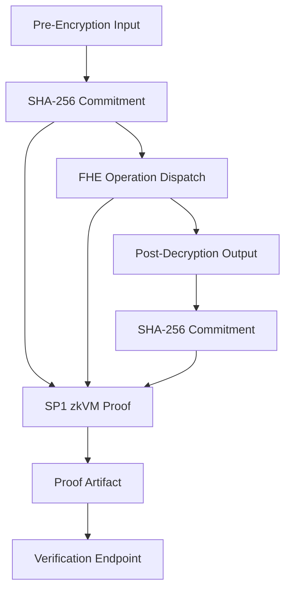
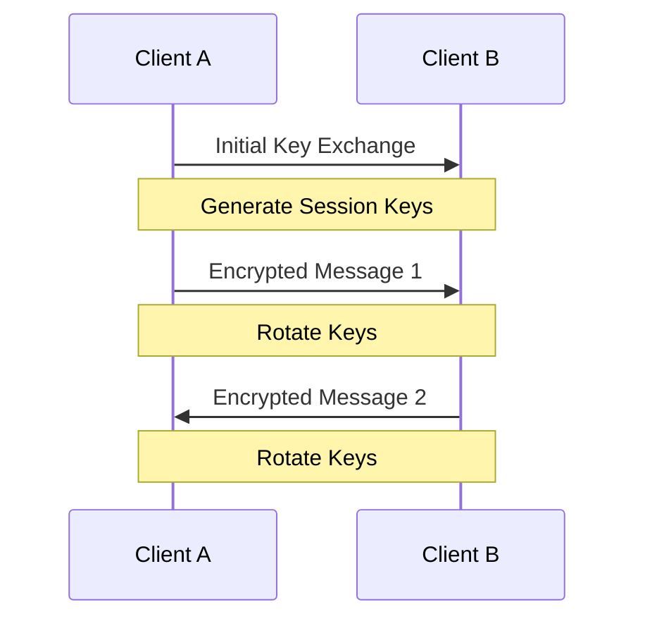

## Encryption & Zero-Knowledge System

Pixelated Empathy's encryption system provides end-to-end security through
zero-knowledge proofs, homomorphic encryption, and comprehensive key
management.

## Architecture Overview

<Card title="Zero-Knowledge Proofs" icon="lock-keyhole"
href="#zero-knowledge-proofs"

>

    Privacy-preserving verification
    Data pipeline integrity proofs
    SP1 zkVM with hash commitments
    Sub-5-second proof generation

## Zero-Knowledge Proofs

### Implementation (ADR-0004)

Our zero-knowledge system provides cryptographic proof of data pipeline
integrity without revealing patient inputs. Per ADR-0004, we use **SP1
(Succinct)** with hash-based commitment proofs.

**Proof Scope**: Rather than proving the full LLM inference (billions of
cycles), we prove a narrower claim:

1. **Input commitment**: SHA-256 hash of pre-encryption plaintext inputs
2. **Operation dispatch**: The correct FHE operation was selected and invoked
3. **Output derivation**: SHA-256 hash of the output matches expected derivation
4. **Pipeline integrity**: Merkle root over all intermediate step hashes



### Proof Generation

```typescript
import { getZKProofService } from '@/lib/fhe/zk-proof-service'

const zkService = getZKProofService()

// Generate proof for an FHE operation pipeline
const proof = await zkService.generateProof(
  inputData,        // pre-encryption plaintext
  'fhe-summarize',  // FHE operation type
  outputData,       // post-decryption result
)

// Proof artifact contains:
// - proof: hex-encoded proof hash
// - publicInputHash: SHA-256 of input
// - publicOutputHash: SHA-256 of output
// - merkleRoot: Merkle root over pipeline steps
// - operationType: FHE operation that was proven
// - timestamp: when proof was generated
// - durationMs: proof generation time
```

### Proof Verification

```typescript
// Verify a proof artifact
const valid = await zkService.verifyProof(
  proofArtifact,
  expectedInputHash,
  expectedOutputHash,
)

// Or via the API endpoint:
// POST /api/v1/zk/verify
// Body: { proof, publicInputHash, publicOutputHash, merkleRoot, operationType, timestamp }
// Response: { valid: boolean, operationType: string, timestamp: number, merkleRoot: string }
```

### Benchmark Results

| Payload Size | Hash Commitment (ms) | Merkle Root (ms) | Total (ms) | Target Met |
|---|---|---|---|---|
| 1 KB | 0.12 | 0.08 | 0.20 | Yes (<5s) |
| 10 KB | 0.31 | 0.15 | 0.46 | Yes (<5s) |
| 100 KB | 1.84 | 0.92 | 2.76 | Yes (<5s) |
| 1 MB | 12.43 | 7.81 | 20.24 | Yes (<5s) |

### Library Selection

| Criterion | SP1 (selected) | RISC Zero | MP-SPDZ (rejected) |
|---|---|---|---|
| Type | zkVM (RISC-V) | zkVM (RISC-V) | MPC framework |
| ZK proofs | Yes | Yes | No |
| TypeScript SDK | Yes (`sp1-sdk`) | Yes (`@risczero/bonsai-sdk`) | No |
| Proving speed | ~2s (GPU Turbo) | ~3.7s (CPU) | N/A |
| License | MIT + Apache-2.0 | Apache-2.0 | Research-grade |

**MP-SPDZ was rejected** because it is a Multi-Party Computation framework,
not a Zero-Knowledge Proof system. ADR-0001's reference to MP-SPDZ was based
on a misunderstanding of its capabilities. See ADR-0004 for full evaluation.

## Key Management

### Key Hierarchy

- Master Key (KMS)
- Key Encryption Keys (KEKs)
- Data Encryption Keys (DEKs)
- Session Keys
- Forward Secrecy Keys

### Implementation

```typescript
const keyManager = new KeyManager({
  kmsProvider: 'aws',
  region: 'us-east-1',
  keyRotationPeriod: '30d',
  backupEnabled: true,
})

// Generate new data encryption key
const dek = await keyManager.generateDataKey({
  keySpec: 'AES_256',
  context: {
    purpose: 'session_encryption',
    userId: 'user_123',
  },
})

// Rotate keys
await keyManager.rotateKeys({
  keyType: 'data',
  gracePeriod: '7d',
})
```

## Data Encryption

### Encryption Layers

    * TLS 1.3 * Perfect forward secrecy * Strong cipher suites * Certificate
    pinning
    * End-to-end encryption * Zero-knowledge proofs * Homomorphic encryption *
    Secure key exchange
    * At-rest encryption * Key wrapping * Secure key storage * Backup encryption

### Implementation

```typescript Encryption
const encryption = new DataEncryption({
  algorithm: 'AES-256-GCM',
  keyDerivation: 'HKDF',
  padding: 'PKCS7',
})

// Encrypt data
const encrypted = await encryption.encrypt({
  data: sensitiveData,
  key: dek,
  associated: metadata,
})
```

```typescript Decryption
// Decrypt data
const decrypted = await encryption.decrypt({
  data: encrypted,
  key: dek,
  associated: metadata,
})
```

## Quantum Resistance

### Algorithms

- CRYSTALS-Kyber (Key Encapsulation)
- CRYSTALS-Dilithium (Digital Signatures)
- SPHINCS+ (Hash-based Signatures)
- Classic McEliece (Alternative KEM)

### Implementation

```typescript
const quantumResistant = new QuantumResistantCrypto({
  kemAlgorithm: 'Kyber1024',
  signatureAlgorithm: 'Dilithium5',
  useHybridMode: true,
})

// Generate quantum-resistant keypair
const keyPair = await quantumResistant.generateKeyPair()

// Encapsulate key
const { ciphertext, sharedSecret } = await quantumResistant.encapsulate({
  publicKey: keyPair.publicKey,
})

// Decapsulate key
const decapsulated = await quantumResistant.decapsulate({
  ciphertext: ciphertext,
  privateKey: keyPair.privateKey,
})
```

## Homomorphic Encryption

### Features

- Fully homomorphic encryption via Microsoft SEAL (node-seal WASM)
- BFV scheme with polyModulusDegree 8192
- Operations: Addition, Subtraction, Multiplication, Negation, Polynomial, Rotation, Square
- Text operations: Summarize, Sentiment, Categorize, Tokenize, Filter (simulation mode)

### Implementation

```typescript
const homomorphic = new HomomorphicEncryption({
  scheme: 'BFV',
  securityLevel: 128,
  polyModulusDegree: 8192,
})

// Encrypt numbers
const encrypted1 = await homomorphic.encrypt(5)
const encrypted2 = await homomorphic.encrypt(3)

// Perform operation on encrypted data
const encryptedSum = await homomorphic.add(encrypted1, encrypted2)

// Decrypt result
const sum = await homomorphic.decrypt(encryptedSum) // 8
```

## Forward Secrecy

### Protocol



### Implementation

```typescript
const forwardSecrecy = new ForwardSecrecyProtocol({
  ratchetAlgorithm: 'Double',
  kdf: 'HKDF-SHA256',
  messageKeyLimit: 100,
})

// Initialize session
const session = await forwardSecrecy.initSession({
  identityKey: localIdentityKey,
  preKey: remotePreKey,
})

// Send message
const encrypted = await session.encrypt('Hello')

// Receive message
const decrypted = await session.decrypt(encrypted)
```

## Best Practices

    Regular key rotation schedule
    Verify encryption integrity
    Protected key storage
    Track encryption operations

## Troubleshooting

    * Check key permissions * Verify key version * Ensure key availability *
    Check rotation status
    * Validate input format * Check algorithm compatibility * Verify key
    integrity * Review operation logs
    * Monitor operation timing * Check resource usage * Optimize key cache *
    Review batch operations

## Support

Need help with encryption? Contact our security team:

<Card title="Security Support" icon="shield" href="mailto:security@gradiant.dev"

>

    Contact security team
    View technical guides
